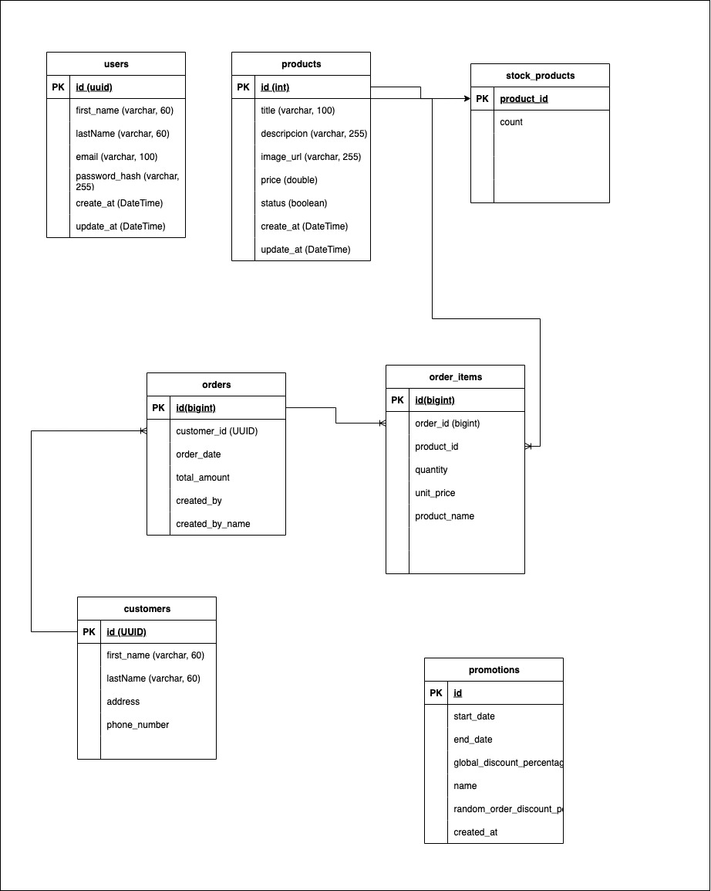

# Ecommerce Service Backend

## Introducción

Este es un servicio backend de comercio electrónico desarrollado en Java con Spring Boot 3.5.4. El proyecto implementa una arquitectura hexagonal (también conocida como arquitectura de puertos y adaptadores) que permite una separación clara entre la lógica de negocio y las tecnologías externas.

El servicio proporciona funcionalidades para:
- Gestión de usuarios y autenticación
- Gestión de productos y stock
- Gestión de pedidos
- Gestión de clientes
- Gestión de promociones
- Reportes de ventas

## Requisitos

Para ejecutar este proyecto necesitas:

- **Java 21** o superior
- **Maven 3.6+** o superior
- **Docker** y **Docker Compose** para la base de datos
- **PostgreSQL 17** (se ejecuta en Docker)

## Configuración de la Base de Datos

### 1. Levantar PostgreSQL con Docker Compose

Crea un archivo `docker-compose.yml` en la raíz del proyecto con el siguiente contenido:

```yaml
version: '3.8'

services:
  postgres:
    image: postgres:17
    container_name: ecommerce_postgres
    environment:
      POSTGRES_DB: ecommerce_service
      POSTGRES_USER: dev_user
      POSTGRES_PASSWORD: DevSecurePass2024!
    ports:
      - "5432:5432"
    volumes:
      - postgres_data:/var/lib/postgresql/data
    restart: unless-stopped

volumes:
  postgres_data:
```

### 2. Ejecutar Docker Compose

```bash
# Levantar la base de datos
docker-compose up -d

# Verificar que el contenedor esté ejecutándose
docker-compose ps

# Ver logs si es necesario
docker-compose logs postgres
```

### 3. Configurar Variables de Entorno

Spring Boot lee las variables de entorno del sistema. Configura las siguientes variables de entorno:

#### Opción 1: Variables del Sistema (Recomendado)

**En macOS/Linux:**
```bash
export DB_HOST=localhost
export DB_NAME=ecommerce_service
export DB_PASSWORD=DevSecurePass2024!
export DB_PORT=5432
export DB_USER=dev_user
```

#### Opción 2: Configuración en IDE

**IntelliJ IDEA:**
1. Ve a `Run` → `Edit Configurations`
2. Selecciona tu configuración de Spring Boot
3. En la pestaña `Environment`, agrega las variables:
   - `DB_HOST=localhost`
   - `DB_NAME=ecommerce_service`
   - `DB_PASSWORD=DevSecurePass2024!`
   - `DB_PORT=5432`
   - `DB_USER=dev_user`

## Ejecutar el Proyecto

### 1. Compilar el proyecto

```bash
mvn clean compile
```

### 2. Ejecutar la aplicación

```bash
mvn spring-boot:run
```

La aplicación estará disponible en `http://localhost:8080`

### 3. Ejecutar tests

```bash
# Ejecutar todos los tests
mvn test

# Ejecutar tests con coverage
mvn test jacoco:report
```

## Arquitectura Hexagonal

Este proyecto implementa la **Arquitectura Hexagonal** (también conocida como Arquitectura de Puertos y Adaptadores), que proporciona:

### Beneficios de la Arquitectura Hexagonal:

- **Separación de responsabilidades**: La lógica de negocio está aislada de las tecnologías externas
- **Testabilidad**: Facilita la escritura de tests unitarios y de integración
- **Flexibilidad**: Permite cambiar tecnologías externas sin afectar la lógica de negocio
- **Mantenibilidad**: Código más organizado y fácil de mantener


### Capas de la Arquitectura:

1. **Domain Layer**: Contiene las entidades de negocio y reglas de dominio
2. **Application Layer**: Orquesta los casos de uso y la lógica de aplicación
3. **Adapter Layer**: Maneja la comunicación con el mundo exterior (REST APIs, base de datos)

## Recursos

### Diagrama de Entidad-Relación



### Colección de Postman

La colección de Postman está disponible en el archivo: [`resources/Ecommerce-service.postman_collection.json`](resources/Ecommerce-service.postman_collection.json)

Esta colección incluye todos los endpoints del API organizados por módulos:

- **Auth**: Login de usuarios
- **Users**: CRUD completo de usuarios
- **Products**: Gestión de productos y stock
- **Customer**: Gestión de clientes
- **Orders**: Creación y consulta de pedidos
- **Reports**: Reportes de productos más vendidos y clientes top
- **Promotions**: Gestión de promociones

#### Variables de Entorno Requeridas

Para usar la colección, configura las siguientes variables en Postman:

- `host`: `http://localhost:8080`
- `accessToken`: Se configura automáticamente después del login
- `userId`: Se configura automáticamente al obtener usuarios
- `customerId`: Se configura automáticamente al crear clientes
- `orderId`: Se configura automáticamente al crear pedidos
- `productId`: ID del producto (configurar manualmente según necesidad)

#### Cómo Importar la Colección

1. Abre Postman
2. Haz clic en "Import" en la esquina superior izquierda
3. Selecciona el archivo `resources/Ecommerce-service.postman_collection.json`
4. La colección se importará con todos los endpoints organizados por módulos
5. Configura la variable `host` en el entorno de Postman
6. Ejecuta primero el endpoint "Login" para obtener el token de acceso
7. Los demás endpoints usarán automáticamente el token generado

---

## Tecnologías Utilizadas

- **Spring Boot 3.5.4**
- **Spring Data JPA**
- **PostgreSQL 17**
- **MapStruct** para mapeo de objetos
- **Spring Security** para autenticación
- **JWT** para tokens de autenticación
- **Lombok** para reducir boilerplate
- **Maven** para gestión de dependencias

## Endpoints Principales

### Autenticación
- **POST** `/api/v1/auth/login` - Login de usuario

### Usuarios
- **POST** `/api/v1/users` - Crear usuario
- **GET** `/api/v1/users` - Obtener todos los usuarios
- **GET** `/api/v1/users/:userId` - Obtener usuario por ID
- **PUT** `/api/v1/users/:userId` - Actualizar usuario
- **DELETE** `/api/v1/users/:userId` - Eliminar usuario

### Productos
- **POST** `/api/v1/products` - Crear producto
- **GET** `/api/v1/products` - Buscar productos (con filtros)
- **GET** `/api/v1/products/:productId` - Obtener producto por ID
- **PUT** `/api/v1/products/:productId` - Actualizar producto
- **POST** `/api/v1/products/:productId/increment-stock` - Incrementar stock
- **DELETE** `/api/v1/products/:productId` - Eliminar producto

### Clientes
- **POST** `/api/v1/customers` - Crear cliente
- **GET** `/api/v1/customers` - Obtener todos los clientes

### Pedidos
- **POST** `/api/v1/orders` - Crear pedido
- **GET** `/api/v1/orders` - Obtener todos los pedidos
- **GET** `/api/v1/orders/:orderId` - Obtener pedido por ID

### Promociones
- **POST** `/api/v1/promotions` - Crear promoción
- **GET** `/api/v1/promotions` - Obtener todas las promociones

### Reportes
- **GET** `/api/v1/reports/top-products` - Productos más vendidos
- **GET** `/api/v1/reports/top-customers` - Clientes con más pedidos

